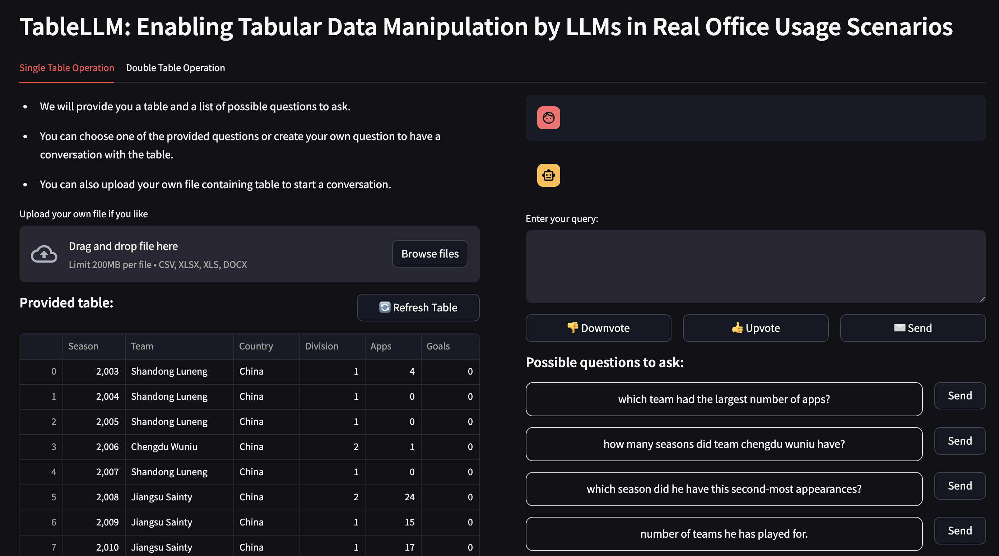

# TableLLM: Enabling Tabular Data Manipulation by LLMs in Real Office Usage Scenarios

| **[Paper](https://arxiv.org/abs/2403.19318)** | **[Homepage](https://tablellm.github.io/)** | **[Model](https://huggingface.co/RUCKBReasoning/TableLLM-13b)** | **[Training set](https://huggingface.co/datasets/RUCKBReasoning/TableLLM-SFT)** |

We present **T**able**LLM**, a powerful large language model designed to handle tabular data manipulation tasks efficiently, whether they are embedded in spreadsheets or documents, meeting the demands of real office scenarios. TableLLM [TableLLM-8B](https://huggingface.co/RUCKBReasoning/TableLLM-8b) is fine-tuned based on Llama3.1-8B.

TableLLM generates either a code solution or a direct text answer to handle tabular data manipulation tasks based on different scenarios. Code generation is used for handling spreadsheet-embedded tabular data, which often involves the insert, delete, update, query, merge, and chart operations of tables. Text generation is used for handling document-embedded tabular data, which often involves the query operation of short tables.

## News
[2025/08] 🛠️ We updated the code, dataset and model checkpoint.

[2025/05] 🎉 TableLLM has been accepted to ACL 2025 as a findings paper. 

[2024/06] 🔥 We open-source the frontend and backend for deploying TableLLM.

[2024/04] 📑 Our paper was published on [arxiv](https://arxiv.org/abs/2403.19318).

[2024/03] 📊 We released [training set](https://huggingface.co/datasets/RUCKBReasoning/TableLLM-SFT).

[2024/02] 📦 We released **TableLLM model**, fine-tuning code, inference code, benchmarks, and evaluation scripts.

## Evaluation Results
We evaluate the code solution generation ability of TableLLM on three benchmarks: WikiSQL, Spider and Self-created table operation benchmark. The text answer generation ability is tested on four benchmarks: WikiTableQuestion (WikiTQ), TAT-QA, FeTaQA. The evaluation result is shown below:

| Model                | WikiTQ | TAT-QA | FeTaQA | WikiSQL | Spider | Self-created | Average |
| :------------------- | :----: | :----: | :----: | :-----: | :----: | :----------: | :-----: |
| TaPEX                |  38.6  |    –   |    –   |   83.9  |  15.0  |       /      |   45.8  |
| TaPas                |  31.6  |    –   |    –   |   74.2  |  23.1  |       /      |   43.0 |
| TableLlama           |  24.0  |  22.3  |  20.5  |   43.7  |    -   |       /      |   23.4  |
| TableGPT2(7B)        |  77.3  |  88.1  |  75.6  |   63.0  |  77.3  |     74.4     |   76.0  |
| Llama3.1(8B)         |  71.9  |  74.3  |  83.4  |   40.6  |  18.8  |     43.2     |   55.3  |
| GPT3.5               |  58.5  |  72.1  |  71.2  |   81.7  |  67.4  |     77.1     |   69.8  |
| GPT4o                |**91.5**|**91.5**|**94.4**|<ins>84.0</ins>|  69.5  |<ins>77.8</ins>|<ins>84.8</ins>|
| CodeLlama (13B)      |  43.4  |  47.3  |  57.2  |   38.3  |  21.9  |     47.6     |   43.6  |
| Deepseek-Coder (33B) |   6.5  |  11.0  |   7.1  |   72.5  |  58.4  |     73.9     |   33.8  |
| StructGPT (GPT3.5)   |  52.5  |  27.5  |  11.8  |   67.8  |**84.8**|       /      |   43.1  |
| Binder (GPT3.5)      |  61.6  |  12.8  |   6.9  |   78.6  |  52.6  |       /      |   36.3  |
| DATER (GPT3.5)       |  53.4  |  28.5  |  18.3  |   58.2  |  26.5  |       /      |   33.0  |
| TableLLM-8B (Ours)  |<ins>89.1</ins>|<ins>89.5</ins>|<ins>93.36</ins>| **89.6**|<ins>81.1</ins>|<ins>77.8</ins>| **86.7**|

## Benchmark Details
We use six public benchmarks and one self-created benchmark for evaluation. As the public benchmarks we used are modified to fit the application scenario of TableLLM, we provide a detailed description of these public benchmarks and self-created benchmarks below. You can obtain the original file of these benchmarks in ```benchmark``` folder.
- WikiTQ: Limit the table to a token count of less than 500 and randomly sample 633 instances.
- TAT-QA: Limit the table to a token count of less than 500 and randomly sample 800 instances.
- FeTaQA: Limit the table to a token count of less than 500 and randomly sample 753 instances.
- WikiSQL: As the WikiSQL testset contains incorrect answers and ambiguous questions, we manually filter out 1000 records and construct a subset of the WikiSQL testset called wikisql-human-annotated.
- Spider: As TableLLM currently focuses on single-table queries, we filter out single-table questions in Spider dev ser and also remove questions whose answers are empty.
- Self-created: We create a new benchmark, including the insert, delete, update, query, merge, and chart operations of tables. For more details, please refer to the paper.

## Prompt Template
The prompts we used for generating code solutions and text answers are introduced below.

### Code Solution
The prompt template for the insert, delete, update, query, and chart operations on a single table.
```
[INST]Below are the first few lines of a CSV file. You need to write a Python program to solve the provided question.

Header and first few lines of CSV file:
{csv_data}

Question: {question}[/INST]
```

The prompt template for the merge operation on two tables.
```
[INST]Below are the first few lines two CSV file. You need to write a Python program to solve the provided question.

Header and first few lines of CSV file 1:
{csv_data1}

Header and first few lines of CSV file 2:
{csv_data2}

Question: {question}[/INST]
```

The csv_data field is filled with the first few lines of your provided table file. Below is an example:
```
Sex,Length,Diameter,Height,Whole weight,Shucked weight,Viscera weight,Shell weight,Rings
M,0.455,0.365,0.095,0.514,0.2245,0.101,0.15,15
M,0.35,0.265,0.09,0.2255,0.0995,0.0485,0.07,7
F,0.53,0.42,0.135,0.677,0.2565,0.1415,0.21,9
M,0.44,0.365,0.125,0.516,0.2155,0.114,0.155,10
I,0.33,0.255,0.08,0.205,0.0895,0.0395,0.055,7
```

### Text Answer
The prompt template for direct text answer generation on short tables.
````
[INST]Offer a thorough and accurate solution that directly addresses the Question outlined in the [Question].
### [Table Text]
{table_descriptions}

### [Table]
```
{table_in_csv}
```

### [Question]
{question}

### [Solution][INST/]
````

## Environment Setup

Install the requirements with pip:
```
pip install -r requirements.txt
```

## Inference
The inference results of TableLLM are provided in ```inference/results``` folder. You can also obtain the inference result by yourself. The example commands of spreadsheet-embedded tabular data (e.g., WikiSQL) and document-embedded tabular data (e.g., WTQ) are shown below:
```
cd inference

python inference_code.py --dataset wikisql --model_path TableLLM-8b

python inference_text.py --dataset wtq --model_path TableLLM-8b
```

## Evaluation
The python code in ```evaluation``` folder is used for reproducing evaluation results. For code generation benchmarks, you can run the following command to reproduce the result of TableLLM-8b on WikiSQL:
```
cd evaluation/wikisql-eval
tar -zxvf csv_tables.tar.gz 
python eval.py --infer_data ../../inference/results/TableLLM-8b/Infer_wikisql.jsonl
```

For text generation, you can obtain it in ```inference/results``` folder and reproduce the results using the following command:
```
cd evaluation/text-eval
python get_sum_grade.py --grade_data ../../inference/results/TableLLM-8b/Grade_wtq.jsonl
```

## Deployment
You can use the code in ```deployment``` folder as the frontend and backend for deploying TableLLM.



Deploy TableLLM using vllm. Remember to modify the PORT and MODEL_PATH in the script and ```config.json```.
```
cd deployment
bash scripts/deploy_tablellm.sh
```

Install mongodb and change the username and password to yours in ```config.json```. Prepare the default tables and questions:
```
bash prepare_default.sh
```

Deploy the streamlit app:
```
streamlit run streamlit.py --server.port PORT
```

## Citation
```
@article{zhang2024tablellm,
  title={TableLLM: Enabling Tabular Data Manipulation by LLMs in Real Office Usage Scenarios},
  author={Zhang, Xiaokang and Luo, Sijia and Zhang, Bohan and Ma, Zeyao and Zhang, Jing and Li Yang and Li, Guanlin and Yao, Zijun and Xu, Kangli and Zhou, Jinchang and Zhang-Li, Daniel and others},
  journal={arXiv preprint arXiv:2403.19318},
  year={2024}
}
```

## Contact
If you have any questions, we encourage you to either create Github issues or get in touch with us at <zhang2718@ruc.edu.cn>, <luosijia0906@ruc.edu.cn>, or <zhang-jing@ruc.edu.cn>.
